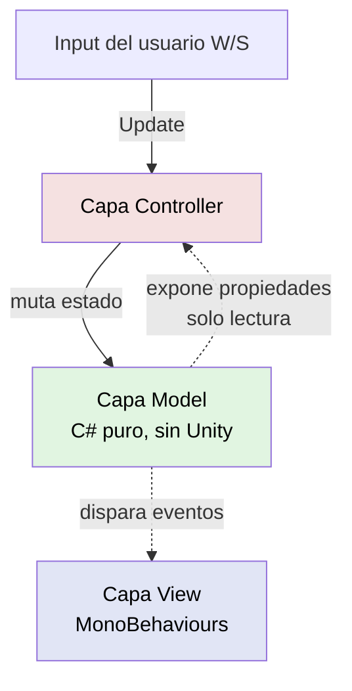
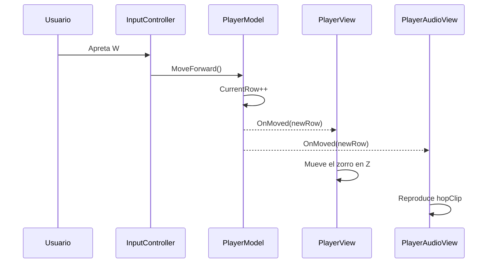
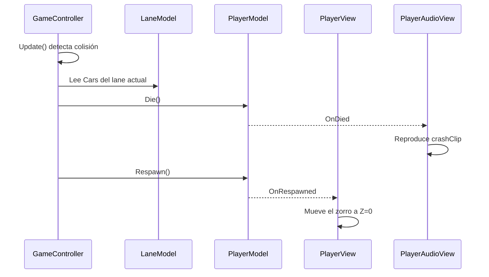

# Diagramas

## Diagrama de dependencias entre capas

```mermaid
graph TD
    Input[Input del usuario W/S]
    Controller[Capa Controller]
    Model[Capa Model<br/>C# puro, sin Unity]
    View[Capa View<br/>MonoBehaviours]

    Input -->|Update| Controller
    Controller -->|muta estado| Model
    Model -.->|dispara eventos| View
    Model -.->|expone propiedades<br/>solo lectura| Controller

    style Model fill:#e1f5e1,color:#000
    style View fill:#e1e5f5,color:#000
    style Controller fill:#f5e1e1,color:#000
```

## Ejemplo: flujo cuando el jugador aprieta W

```mermaid
sequenceDiagram
    participant U as Usuario
    participant IC as InputController
    participant PM as PlayerModel
    participant PV as PlayerView
    participant PAV as PlayerAudioView

    U->>IC: Apreta W
    IC->>PM: MoveForward()
    PM->>PM: CurrentRow++
    PM-->>PV: OnMoved(newRow)
    PM-->>PAV: OnMoved(newRow)
    PV->>PV: Mueve el zorro en Z
    PAV->>PAV: Reproduce hopClip
```

## Ejemplo: flujo de una colisión con un auto

```mermaid
sequenceDiagram
    participant GC as GameController
    participant LM as LaneModel
    participant PM as PlayerModel
    participant PV as PlayerView
    participant PAV as PlayerAudioView

    GC->>GC: Update() detecta colisión
    GC->>LM: Lee Cars del lane actual
    GC->>PM: Die()
    PM-->>PAV: OnDied
    PAV->>PAV: Reproduce crashClip
    GC->>PM: Respawn()
    PM-->>PV: OnRespawned
    PV->>PV: Mueve el zorro a Z=0
```
