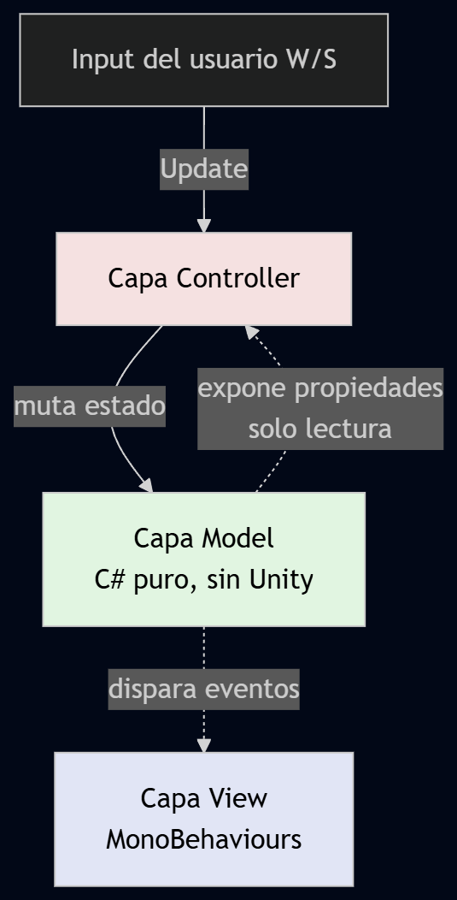
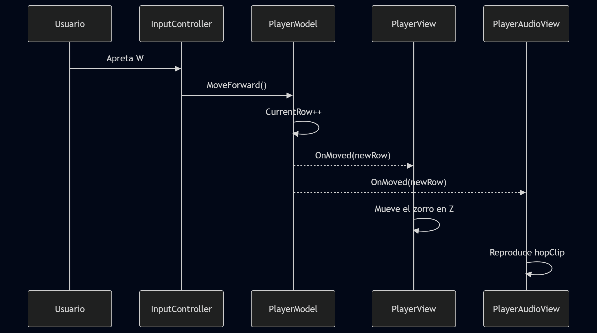
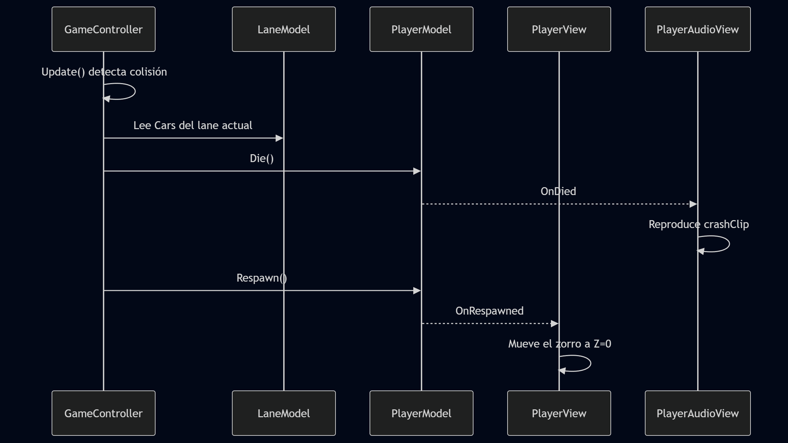

# Decisiones de Arquitectura - Frogger TP2

Este documento contiene el detalle de los ¿Qué?, ¿Comos? y ¿Por qué? sobre la arquitectura elegida.

## ¿Qué arquitectura elegí?

De las opciones disponibles (MVC, MVP, ECS) opté por elegir la de MVC (Modelo Vista Controlador).

## ¿Por qué?

Tres ítems principales de porqué elegí mvc.

- Me permite separar la lógica dura (grilla, vidas) de los gráficos de Unity.
- Es mucho más rápido y directo de programar que MVP (menos scripts puente).
- Es infinitamente más simple de implementar y mantener que ECS para un proyecto pequeño con pocos objetos.

En resumen el patrón elegido MVC me pareció que tenia el equilibrio perfecto entre complejidad y usabilidad. Mientras el patrón MVP brilla cuando se tiene una UI compleja, ECS se destaca en sistemas complejos con muchísima cantidad de entidades (escala masiva). No hace falta aclarar que para un juego simple como Frogger, que prácticamente no tiene UI y entidades a lo sumo sólo 2 la rana(En mi caso un zorro) y los autos la mejor elección en lo personal fué MVC.

## ¿Cómo?

Como su enunciado bien lo indica, el patrón MVC consta de tres capas principales (Modelo, Vista y Controlador)

```bash
├───Controller
│       GameController.cs
│       InputController.cs
│       SceneLoader.cs
│
├───Model
│       CarModel.cs
│       GameStateModel.cs
│       LaneModel.cs
│       PlayerModel.cs
│
└───View
        CameraFollow.cs
        CarView.cs
        LaneView.cs
        PlayerAudioView.cs
        PlayerView.cs
```

### La capa Controller

En esta capa asigne los 3 principales componentes que "manejaran" la lógica del juego, cómo las transiciones entre esceneas, el gameloop y el input del usuario.

- GameController : Es el gameloop del juego su responsabilidad de la de definir donde empieza y termina el juego. Asi también como las condiciones de Victoria y "Derrota"(en este caso no se pierde se vuelve al inicio)
- InputController: Maneja el input del usuario (W y S) y dispara los eventos necesarios para que el modelo actualice su estado.
- SceneLoader : Un  script básico para controlar la transición entre escenas.

### La capa Model

A esta capa pertenecen las clases que contienen el "ESTADO" de las distintas entidades.

- CarModel : Su posición , su velocidad y su ancho(Para el manejo de colisiones)
- GameStateModel: El estado del gameloop (Jugando/Ganó).
- LaneModel: La configuración de las distintas líneas, como su intervalo de aparición, velocidad de los autos, ancho e Indice de si misma respecto a las demás.
- PlayerModel: Su fila actual, su objetivo de filas y si chocó o no con un auto.

### La capa View

Esta capa contiene todas las clases necesarias para "mostrar" el juego en pantalla de forma correcta. Se encargan también de inicializar los modelos.

- CameraFollow : Script simple para seguir el player en el mapa.
- CarView : Su posición (fila) en el mundo.
- LaneView : Su posición en el mundo, y el prefab de los autos que tiene que instanciar.
- PlayerAudioView: Script simple para reproducir SFX.
- PlayerView: Sabe cuanto mide su salto, para mostrarse de forma correcta a medida que se mueve hacia delante o hacia atrás.

## Diagramas

## Diagrama de arquitectura aplicada



### Ejemplo cuando usuario apreta W



### Ejemplo cuando la rana colisiona con un auto


